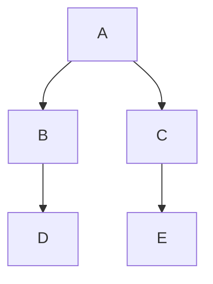
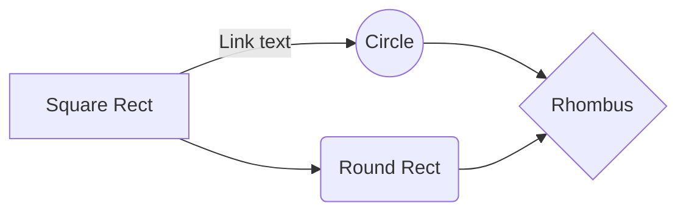

# 見出し1
## 見出し2
#### 見出し4
###### 見出し6

*イタリック*
_イタリック_
**太字**
__太字__

* リスト項目1
+ リスト項目2
- リスト項目3

1. リスト項目1
2. リスト項目2
3. リスト項目3

- リスト1
    - ネスト リスト1_1
        - ネスト リスト1_1_1
        - ネスト リスト1_1_2
    - ネスト リスト1_2
- リスト2
- リスト3

> 引用
>> 二重引用

テキスト[^1]
[^1]: 注釈内容

 `print('Code Block');`

| Left align | Right align | Center align |
|:-----------|------------:|:------------:|
| This       |        This |     This     |
| column     |      column |    column    |
| will       |        will |     will     |
| be         |          be |      be      |
| left       |       right |    center    |
| aligned    |     aligned |   aligned    |

---
水平線
***
水平線
* * *

[Qiita](http://qiita.com/)

<!-- タイトル無しの画像を埋め込む -->

<!-- タイトル有りの画像を埋め込む -->

~~取り消し線~~

- [ ] チェックボックス 1
- [ ] チェックボックス 2
- [x] チェックボックス 3

